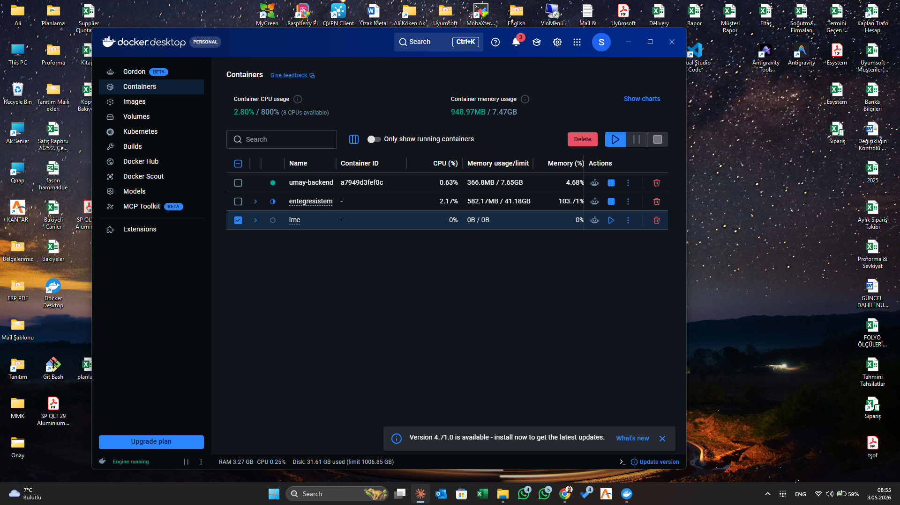
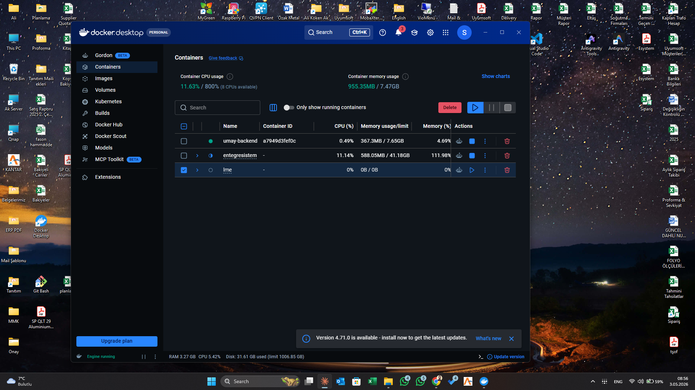
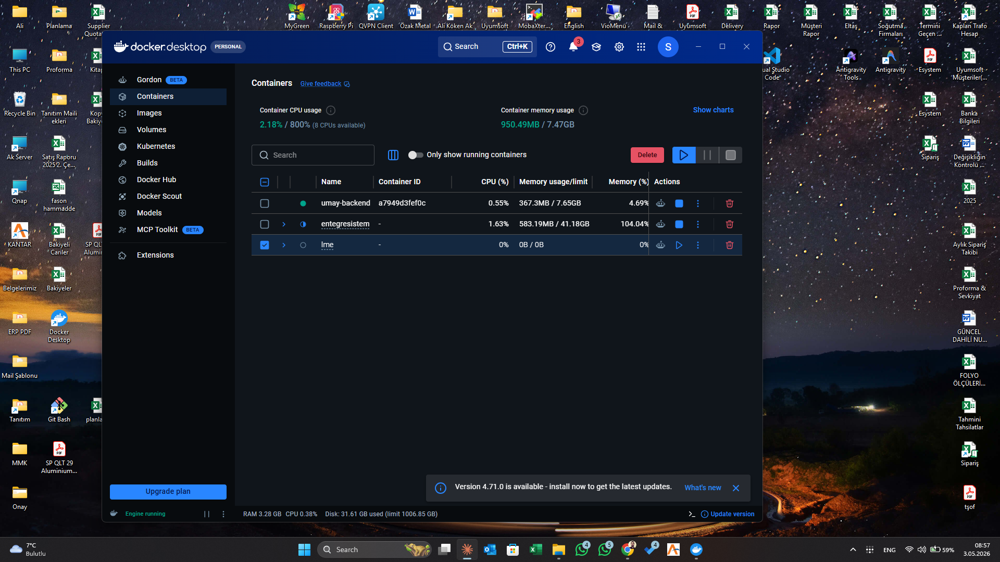
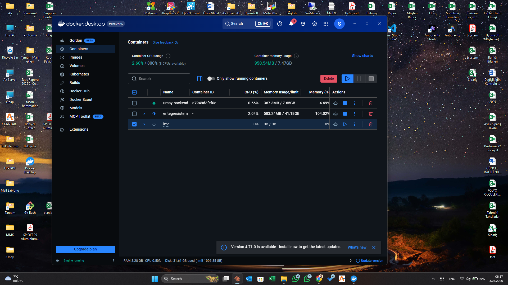
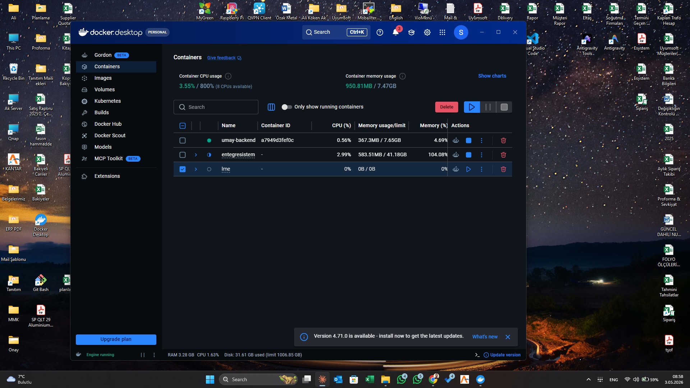

<div align="center">


# Ergenekon Entegre Sistemi

**Umay** · Finansal Yönetim &nbsp;|&nbsp; **Ötüken** · Arazi & Operasyon Yönetimi

*Self-hosted, integrated farm & business management platform*

[](https://hub.docker.com/r/signorali/umay-backend)
[](https://hub.docker.com/r/signorali/umay-backend)
[](https://github.com/signorali/ergenekon/releases)
[](#-lisans--license)

[🇹🇷 Türkçe](#-türkçe) · [🇬🇧 English](#-english) · [📸 Ekran Görüntüleri](#-ekran-görüntüleri--screenshots) · [🚀 Hızlı Kurulum](#-hızlı-kurulum--quick-install)

</div>

---

## 📸 Ekran Görüntüleri / Screenshots

### 💰 Umay — Finansal Yönetim / Financial Management

<div align="center">
<table>
<tr>
<td align="center"><br/><sub>Ana Sayfa / Dashboard</sub></td>
<td align="center"><br/><sub>İşlemler / Transactions</sub></td>
</tr>
<tr>
<td align="center"><br/><sub>Raporlar / Reports</sub></td>
</tr>
</table>
</div>

### 🌾 Ötüken — Arazi & Operasyon Yönetimi / Farm & Operations Management

<div align="center">
<table>
<tr>
<td align="center"><br/><sub>Operasyon Takibi / Operations</sub></td>
<td align="center"><br/><sub>Hasat Satışları / Harvest Sales</sub></td>
</tr>
</table>
</div>

---

## 🚀 Hızlı Kurulum / Quick Install

```bash
curl -fsSL https://get.umay.app/install | sudo bash
```

---

## 🇹🇷 Türkçe

### Sistem Nedir?

**Ergenekon Entegre Sistemi**, iki birbirini tamamlayan modülden oluşur:

- 🏦 **Umay** — Finansal yönetim: gelir/gider, banka hesapları, kredi kartları, raporlar, varlık takibi
- 🌾 **Ötüken** — Arazi & operasyon yönetimi: sulama, gübreleme, hasat, envanter, satış, maliyet takibi

Her iki modül aynı Docker Compose ortamında çalışır. Ötüken'deki tarımsal hareketler (satın alma, satış, işçilik maliyeti) otomatik olarak Umay'a muhasebe kaydı olarak düşer.

### ✨ Özellikler

#### 💰 Umay — Finansal Yönetim

| Özellik | Açıklama |
|---------|----------|
| 💰 Gelir / Gider Takibi | Tüm finansal hareketlerinizi kategorize edin |
| 🏦 Çoklu Banka Hesabı | Birden fazla hesabı tek ekrandan yönetin |
| 💳 Kredi Kartı Yönetimi | Ekstre takibi ve kapanma bildirimleri |
| 📊 Raporlama | Dönemsel raporlar, grafikler ve analiz |
| 🏠 Varlık Takibi | Araç, ekipman, gayrimenkul portföyü |
| 👥 Çoklu Kullanıcı | Rol tabanlı erişim yönetimi |
| 🔄 Otomatik Güncelleme | Tek tıkla sistem güncellemesi |
| 🔐 Güvenli | HTTPS, JWT, rate limiting, brute-force koruması |
| 📱 Tablet Uygulaması | Android tablet desteği |

#### 🌾 Ötüken — Arazi & Operasyon Yönetimi *(Enterprise)*

| Özellik | Açıklama |
|---------|----------|
| 🚜 Operasyon Takibi | Sulama, gübreleme, ilaçlama, hasat kayıtları |
| 📦 Envanter & Demirbaş | Stok ve ekipman yönetimi |
| 🌍 Arazi Yönetimi | Parsel bazlı operasyon ve maliyet takibi |
| 🛒 Alış / Satış | Hasat satışları ve karlılık görünümü |
| 💧 DSI Sulama Kartı | Sulama abonman bakiyesi ve işlem geçmişi |
| 🔗 Umay Entegrasyonu | Tüm maliyetler otomatik muhasebe kaydına düşer |

### 📋 Gereksinimler

| Bileşen | Minimum | Önerilen |
|---------|---------|----------|
| CPU | 1 çekirdek | 2+ çekirdek |
| RAM | 2 GB | 4 GB (Raspberry Pi 4 4GB+ ideal) |
| Disk | 5 GB | 20 GB+ |
| İşletim Sistemi | Linux (x86\_64, ARM64, ARMv7) | Ubuntu 22.04 / Debian 12 |
| Docker | 20.10+ | Son sürüm |

### 🛠 Kurulum

#### Tek Komut (Önerilen)

```bash
curl -fsSL https://get.umay.app/install | sudo bash
```

Kurulum sırasında:
- Docker otomatik yüklenir (yoksa)
- Güvenlik anahtarları otomatik üretilir
- Opsiyonel: Domain adı girilir (SSL sertifikası için)
- Servisler başlatılır (~2–3 dakika)

#### Manuel Kurulum

```bash
# 1. Dizin oluştur
mkdir -p /opt/ergenekon && cd /opt/ergenekon

# 2. Dosyaları indir
curl -fsSL https://raw.githubusercontent.com/signorali/ergenekon/main/install/docker-compose.yml -o docker-compose.yml
mkdir -p nginx
curl -fsSL https://raw.githubusercontent.com/signorali/ergenekon/main/install/nginx/nginx.conf -o nginx/nginx.conf

# 3. .env oluştur (şifreleri değiştirin)
cat > .env << 'EOF'
APP_VERSION=latest
DB_PASSWORD=guclu-bir-sifre-girin
REDIS_PASSWORD=redis-sifresi
JWT_SECRET=en-az-64-karakter-jwt-secret-buraya-girin
INTERNAL_API_KEY=48-karakter-api-key-buraya-girin
DOMAIN=
EOF
chmod 600 .env

# 4. Başlat
docker compose up -d
```

### 🔒 HTTPS Kurulumu

Kurulum tamamlandıktan sonra terminalde şu bilgi görünür:

```
🔒 HTTPS Sertifikası — Tek Seferlik Kurulum:
  → http://<sunucu-ip>/ca.crt   ← Bu adresten indirin
```

CA sertifikasını indirip cihazlarınıza kurun:

| Platform | Adımlar |
|----------|---------|
| **Windows** | `.crt` dosyasına çift tıkla → *Güvenilen Kök CA* → Yükle |
| **macOS** | Çift tıkla → Anahtarlık → *"Her Zaman Güven"* |
| **Linux** | `sudo cp ergenekon-ca.crt /usr/local/share/ca-certificates/ && sudo update-ca-certificates` |
| **Android** | Ayarlar → Güvenlik → Sertifika Yükle → CA Sertifikası |
| **iOS** | İndir → Ayarlar → İndirilen Profil → Yükle → Güven Etkinleştir |

> Sertifika sunucu değişmediği sürece geçerlidir (10 yıl). Cihaz başına yalnızca bir kez yapılır.

### 🔄 Güncelleme

```bash
cd /opt/ergenekon
docker compose pull && docker compose up -d
```

Veya Umay arayüzünden: **Ayarlar → Sistem → Şimdi Güncelle**

### 🛠 Yararlı Komutlar

```bash
cd /opt/ergenekon

docker compose ps                                    # Servis durumu
docker compose logs -f                               # Canlı log
docker compose logs -f umay-backend                 # Belirli servis logu
docker compose restart                               # Yeniden başlat
docker compose pull && docker compose up -d          # Güncelle
docker compose down                                  # Durdur (veriler korunur)
```

---

## 🇬🇧 English

### What is Ergenekon?

**Ergenekon** is an integrated self-hosted platform consisting of two complementary modules:

- 🏦 **Umay** — Financial management: income/expense, bank accounts, credit cards, reporting, asset tracking
- 🌾 **Ötüken** — Farm & operations management: irrigation, fertilization, harvest, inventory, sales, cost tracking

Both modules run in the same Docker Compose environment. Agricultural transactions in Ötüken (purchases, sales, labour costs) are automatically posted as accounting entries in Umay.

### ✨ Features

#### 💰 Umay — Financial Management

| Feature | Description |
|---------|-------------|
| 💰 Income / Expense Tracking | Categorize all your financial transactions |
| 🏦 Multiple Bank Accounts | Manage multiple accounts from one screen |
| 💳 Credit Card Management | Statement tracking and closing notifications |
| 📊 Reporting | Periodic reports, charts and analysis |
| 🏠 Asset Tracking | Vehicles, equipment, real estate portfolio |
| 👥 Multi-user | Role-based access management |
| 🔄 Auto-update | One-click system update |
| 🔐 Secure | HTTPS, JWT, rate limiting, brute-force protection |
| 📱 Tablet App | Android tablet support |

#### 🌾 Ötüken — Farm & Operations Management *(Enterprise)*

| Feature | Description |
|---------|-------------|
| 🚜 Operation Tracking | Irrigation, fertilization, spraying, harvest records |
| 📦 Inventory & Assets | Stock and equipment management |
| 🌍 Land Management | Plot-based operations and cost tracking |
| 🛒 Purchase / Sales | Harvest sales and profitability view |
| 💧 DSI Irrigation Card | Irrigation subscription balance and history |
| 🔗 Umay Integration | All costs automatically posted to accounting |

### 📋 Requirements

| Component | Minimum | Recommended |
|-----------|---------|-------------|
| CPU | 1 core | 2+ cores |
| RAM | 2 GB | 4 GB (Raspberry Pi 4 4GB+ ideal) |
| Disk | 5 GB | 20 GB+ |
| OS | Linux (x86\_64, ARM64, ARMv7) | Ubuntu 22.04 / Debian 12 |
| Docker | 20.10+ | Latest |

### 🛠 Installation

#### One-Command Install (Recommended)

```bash
curl -fsSL https://get.umay.app/install | sudo bash
```

During installation:
- Docker is installed automatically (if missing)
- Security keys are auto-generated
- Optional: Enter your domain name (for SSL certificate)
- Services start (~2–3 minutes)

#### Manual Installation

```bash
# 1. Create directory
mkdir -p /opt/ergenekon && cd /opt/ergenekon

# 2. Download files
curl -fsSL https://raw.githubusercontent.com/signorali/ergenekon/main/install/docker-compose.yml -o docker-compose.yml
mkdir -p nginx
curl -fsSL https://raw.githubusercontent.com/signorali/ergenekon/main/install/nginx/nginx.conf -o nginx/nginx.conf

# 3. Create .env (change passwords)
cat > .env << 'EOF'
APP_VERSION=latest
DB_PASSWORD=enter-a-strong-password
REDIS_PASSWORD=redis-password
JWT_SECRET=at-least-64-chars-jwt-secret-here
INTERNAL_API_KEY=48-char-api-key-here
DOMAIN=
EOF
chmod 600 .env

# 4. Start
docker compose up -d
```

### 🔒 HTTPS Setup

After installation, the terminal shows:

```
🔒 HTTPS Certificate — One-Time Setup:
  → http://<server-ip>/ca.crt   ← Download from this address
```

Download and install the CA certificate on your devices:

| Platform | Steps |
|----------|-------|
| **Windows** | Double-click `.crt` → *Trusted Root Certificate Authorities* → Install |
| **macOS** | Double-click → Keychain → *"Always Trust"* |
| **Linux** | `sudo cp ergenekon-ca.crt /usr/local/share/ca-certificates/ && sudo update-ca-certificates` |
| **Android** | Settings → Security → Install Certificate → CA Certificate |
| **iOS** | Download → Settings → Downloaded Profile → Install → Enable Trust |

> Certificate is valid as long as the server doesn't change (10 years). Done once per device.

### 🔄 Update

```bash
cd /opt/ergenekon
docker compose pull && docker compose up -d
```

Or from the Umay interface: **Settings → System → Update Now**

### 🛠 Useful Commands

```bash
cd /opt/ergenekon

docker compose ps                                    # Service status
docker compose logs -f                               # Live logs
docker compose logs -f umay-backend                 # Specific service logs
docker compose restart                               # Restart
docker compose pull && docker compose up -d          # Update
docker compose down                                  # Stop (data preserved)
```

---

## 🐳 Docker Hub

| Image | Tags |
|-------|------|
| [`signorali/umay-backend`](https://hub.docker.com/r/signorali/umay-backend) | `latest`, `x.y.z` |
| [`signorali/umay-frontend`](https://hub.docker.com/r/signorali/umay-frontend) | `latest`, `x.y.z` |

Her yeni sürüm [GitHub Releases](https://github.com/signorali/ergenekon/releases) sayfasında değişiklik notlarıyla yayınlanır.

*Each new version is published on [GitHub Releases](https://github.com/signorali/ergenekon/releases) with detailed changelog.*

---

## 📝 Lisans / License

Umay, bireysel ve küçük işletme kullanımı için **ücretsiz (Community)** olarak sunulmaktadır.  
*Umay is **free (Community edition)** for individual and small business use.*

| Sürüm / Edition | Kapsam / Scope | Lisans / License |
|-----------------|----------------|------------------|
| Community | Bireysel, KOBİ / Individual, SMB | Ücretsiz / Free |
| Enterprise | Ötüken entegrasyonu, çoklu şube / Ötüken integration, multi-branch | Ticari / Commercial |

### 📬 İletişim / Contact

Lisans talebi, kurumsal destek veya özelleştirme için:  
*For licensing, enterprise support or customization:*

**[alikoken@outlook.com](mailto:alikoken@outlook.com)**

---

<div align="center">
<sub>Umay — Verileriniz sizin, sunucunuz sizin, kontrolünüz sizin.</sub><br/>
<sub>Umay — Your data, your server, your control.</sub>
</div>
